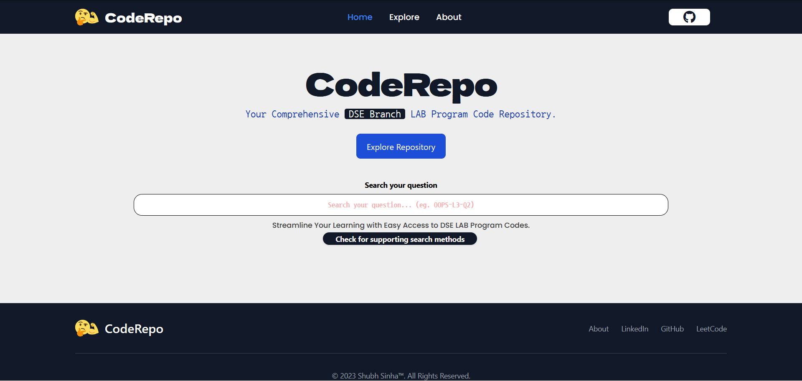
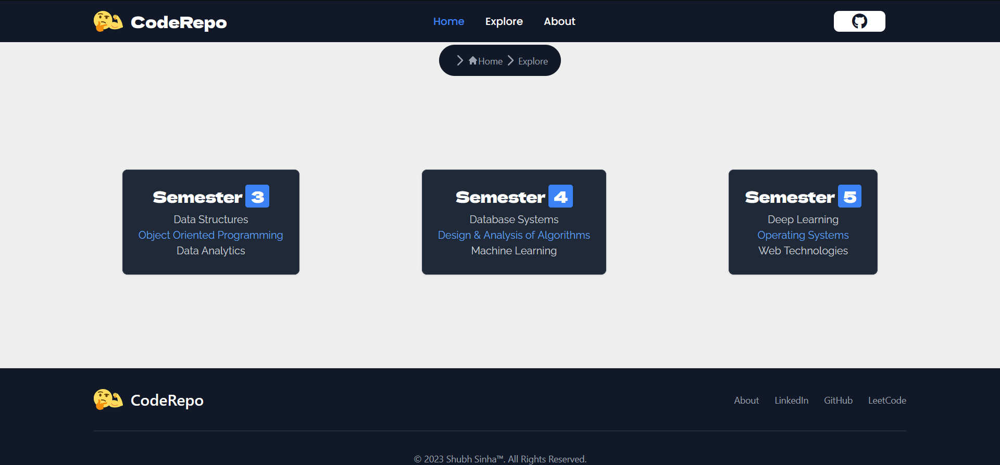
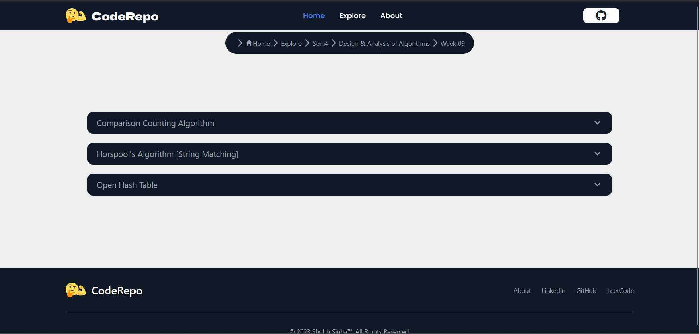

# CodeRepo - Your Ultimate Destination for DSE Lab Codes

**Table of Contents**
- [Overview](#overview)
- [Features](#features)
- [Technologies Used](#technologies-used)
- [Getting Started](#getting-started)
- [Usage](#usage)
- [Search](#search)
- [Navigation](#navigation)
- [Code Highlighting](#code-highlighting)
- [Screenshots](#screenshots)
- [GitHub Integration](#github-integration)
- [Deployment](#deployment)
- [Contributing](#contributing)
- [Contact](#contact)

## Overview

**CodeRepo** is a web project developed to serve as a comprehensive platform for **Data Science & Engineering** (DSE) students at MIT Manipal. It simplifies the process of accessing lab codes and their corresponding answers for all DSE lab sessions, regardless of the semester. With powerful search capabilities, an intuitive navigation system, and a clean, minimalistic UI, **CodeRepo** aims to enhance the learning experience for DSE students.

## Features

### 1. Quick Search
Easily find lab questions by entering the lab name, number, and question number directly on the homepage. This feature saves you valuable time by instantly providing the relevant lab code and answers.

### 2. Explore by Semester, Lab, and Week
Prefer a more organized approach? Explore lab questions semester-wise, lab-wise, and week-wise. This intuitive navigation system ensures you never miss out on any lab material.

### 3. Responsive Design
CodeRepo is built with Tailwind CSS to ensure a responsive and visually appealing user experience across various devices and screen sizes.

### 4. Code Highlighting
Make your code look better and more readable with the integration of highlightJS. Lab codes and answers are presented in a visually appealing format for easy comprehension.

### 5. GitHub Integration
Access the original DSE repository on GitHub directly from the navigation bar, allowing you to explore additional resources and contribute to the community.

## Technologies Used

CodeRepo utilizes the following technologies and libraries:

- **Frontend**: React with Vite
- **CSS Framework**: Tailwind CSS
- **Routing**: react-router-dom
- **Icons**: Font Awesome
- **Code Highlighting**: highlightJS
- **Data Source**: GitLab API

## Getting Started

To get started with CodeRepo, follow these steps:

1. Visit the website: [CodeRepo](https://dsecoderepo.vercel.app/)
2. Use the search bar on the homepage to find specific lab questions or explore semesters, labs, and weeks.
3. Click on the lab question you're interested in to view the code and answers.
4. Enjoy the clean and minimalistic UI for a seamless browsing experience.

## Usage

### Search

To quickly find lab questions, use the search bar on the homepage. Enter the lab name, number, and question number, and CodeRepo will instantly provide the relevant lab code and answers.

### Navigation

Navigate through lab questions using the following methods:

- **Semester-wise**: Explore lab questions organized by semesters.
- **Lab-wise**: Browse lab questions by specific labs.
- **Week-wise**: Find lab questions based on the week of the semester.

### Code Highlighting

CodeRepo uses highlightJS to apply syntax highlighting to code snippets, making them more readable and visually appealing.

### Screenshots

Here are some screenshots of CodeRepo to give you a glimpse of the user interface:

 

## GitHub Integration

CodeRepo is closely integrated with GitHub, where the original DSE repository resides. This integration allows for seamless navigation between CodeRepo and the GitHub repository. You can explore additional resources and contribute to the community directly through GitHub.

## Deployment

CodeRepo is deployed on Vercel, ensuring fast and reliable access to lab codes and answers whenever you need them. Vercel provides a robust hosting platform, keeping your experience smooth and efficient.

## Contributing

We welcome contributions from the MIT Manipal DSE community and beyond. If you have lab codes, answers, or improvements to suggest, please consider contributing to this project. Feel free to open issues, submit pull requests, or reach out to us with your ideas.

## Contact

If you have any questions, suggestions, or issues to report, please don't hesitate to contact us:

- Email: [codeshubh@gmail.com](mailto:codeshubh@gmail.com)
- Original DSE GitHub Repository: [DSE GitHub](https://github.com/shrudex/DSE)

Thank you for using CodeRepo, and we hope it becomes an invaluable resource for your DSE journey. Happy coding!

